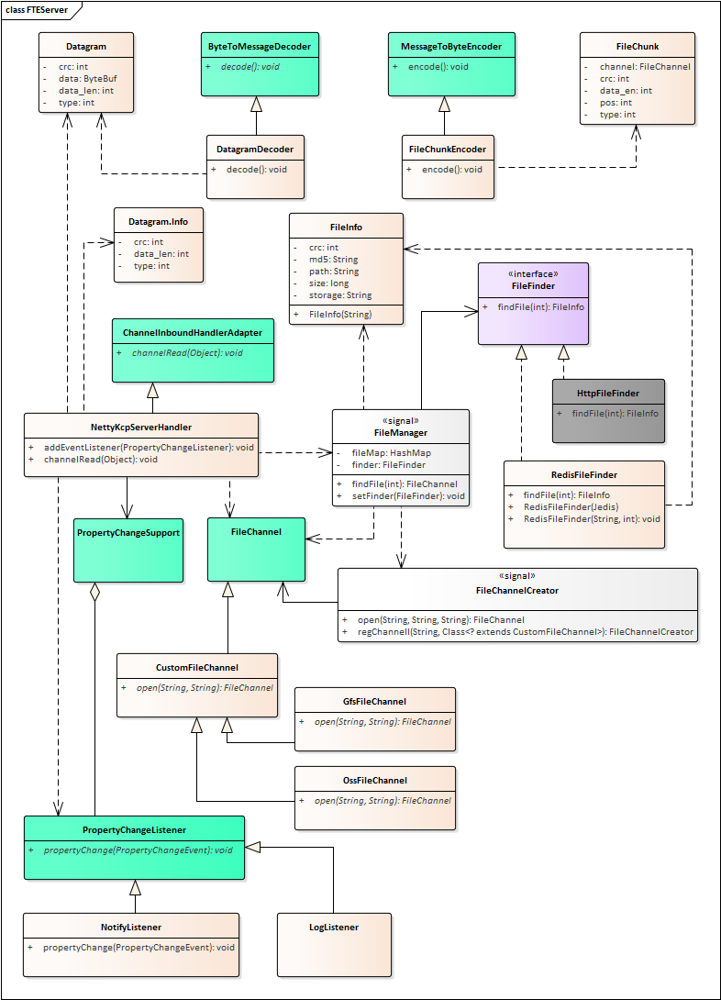
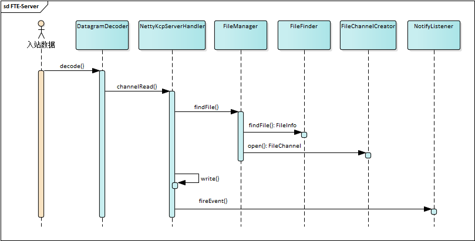

# goethe-transfer

Streaming file transfer over UDP

## 1. 背景

### 1.1、问题

一般Web服务使用的是web框架自带的文件传输，使用的也是标准HTTP协议。这种方法的优点是简单、通用，几乎不用关心具体实现。但同时缺点也有不少：

1) 效率非最优：HTTP协议本身在数据传输的方面并不高效
2) 不利于扩展：比如引入并发、压缩等
3) 传控混杂：传输与控制的通道混杂在了一起，造成不必要的干扰

### 1.2、协议

HTTP是一个基于文本的协议，HTTP基于TCP，而TCP又是为可靠性设计的，所以基于HTTP的方案，并不是文件传输最好的选择。尤其是在超远距离传输、网络环境较差的情况下，TCP自身的重传设计会使效率变得非常糟糕。

在这种情况下，基于UDP的传输会更好一点。UDP的缺点是，缺乏可靠性，不保证数据包一定能传递到位，这又恰恰是TCP的优点。但是现在有很多基于UDP的ARQ实现，KCP就是比较成熟的一种。

* KCP： https://github.com/skywind3000/kcp

> KCP是一个快速可靠协议，能以比 TCP浪费10%-20%的带宽的代价，换取平均延迟降低 30%-40%，且最大延迟降低三倍的传输效果。纯算法实现，并不负责底层协议（如UDP）的收发，需要使用者自己定义下层数据包的发送方式，以 callback的方式提供给 KCP。 连时钟都需要外部传递进来，内部不会有任何一次系统调用。


### 1.3、框架

确定好UDP协议后，可选择```netty```作为服务端框架，充分利用框架的异步与事件驱动。

### 1.4、配套

* Redis：数据共享
* Kafka：消息列队


## 2. 概要

* 语言：Java
* 版本：1.7+
* 工程：http://192.168.7.141/server/fte-server

## 3. 结构

```
fte-server/
│
├── fte-common/ <基础模块>
├── netty-kcp-server/ <基于netty的实现>
├── netty-kcp-client/ <测试客户端>
├── .gitignore
└── README.md
```

## 4. 开始

**1. 获取代码**

```
git clone http://192.168.7.141/server/fte-server.git
```

**2. 进入目录**

```
cd fte-server
```

**3. 编译安装**

```
mvn install
```

**4. 运行程序**

* 运行服务端

```
cd netty-kcp-server
mvn exec:java
```

* 运行测试客户端

```
cd netty-kcp-client
mvn exec:java
```

## 5. 框架

### 5.1. 主要依赖

| 依赖项 | 版本 | 说明 |
| --- | --- | --- |
| io.netty.netty-all | 4.1.37.Final | 网络框架 |
| io.jpower.kcp.kcp-netty | 1.4.6 | 基于netty的kcp实现 |
| org.mockito.mockito-core | 3.0.0 | 单元测试时的mock库 |
| redis.clients.jedis | 3.1.0 | Redis客户端操作库 |

### 5.2. Netty

在```netty```中，核心概念是Bootstrap、Channel、EventLoop、ChannelFuture与ChannelHandler。

* Bootstrap：程序配置与运行
* Channel：Socket；
* EventLoop：控制流、多线程处理、并发；
* ChannelFuture：异步通知；
* ChannelHandler：处理事件。

从应用程序开发人员的角度来看，Netty 的主要组件是ChannelHandler，程序的处理逻辑主要是从这里引发。框架中的其它模块不需要关注太多。

在本项目中，```NettyKcpServerHandler```就是最关键的处理入口。

### 5.3. Kcp-Netty

**Kcp-Netty** 使用kcp协议重写了netty的一些关键元素：

* UkcpServerBootstrap
* UkcpChannel
* UkcpServerChannel
* UkcpChannelOption

使用kcp-netty时基本上也就是将这些类替换掉原本的。

### 5.4. 编码器与解码器

netty通过**pipeline**机制将消息做链式处理，上面可以挂载各种处理器，对数据流进行处理。通常的做法是让出站的数据（发送方），经由自定义的编码器，将对象编码成字节流（ByteBuf）；相对的，在入站的数据（接收方）经由自定义的解码器，将节点流解码成对象。

这样一来，在程序内部就不需要关心字节流，直接使用对象即可。

在我们的系统中，有相应的类：

* 编码器DatagramEncoder

```java
protected void encode(ChannelHandlerContext, channelHandlerContext,  Datagram datagram, ByteBuf byteBuf) throws Exception {    
    byteBuf.writeInt(datagram.getCrc()); 
    byteBuf.writeShort(datagram.getType());
    byteBuf.writeShort(datagram.getData_len());
    byteBuf.writeBytes(datagram.getData(), datagram.getData_len());
}
```

* 解码器：DatagramDecoder

```java
protected void decode(ChannelHandlerContext channelHandlerContext, ByteBuf byteBuf, List<Object> list) throws Exception {   
    int crc = byteBuf.readInt();    
    int type = byteBuf.readShort();   
    int data_len = byteBuf.readShort(); 
// ...
}
```

### 5.5. 数据包

数据包的结构定义如下：

* 结构示意：

```
0              20    28                 52     60                                         572
+----------+----+------------+----+-----------------------------+
    ip              udp      kcp            lfs                   data
```


* 说明：

| 开始位置 | 结束位置 | 字段 | 长度 |
| --- | --- | --- | --- |
| 000 | 019 | ip头 | 20字节 |
| 020 | 027 | udp头 | 8字节 | 
| 028 | 051 | kcp头 | 24字节 | 
| 052 | 059 | lfs头（缓冲区首包） | 8字节 | 
| 060 | 571 | 数据 | 512字节 |

* lfs头：

| 开始位置 | 结束位置 | 字段 | 长度 |
| --- | --- | --- | --- |
| 000 | 003 | 文件CRC ID | 4字节 |
| 004 | 005 | 数据类型（大端模式） | 2字节 | 
| 006 | 007 | 数据长度（大端模式） | 2字节 | 

* 其中，数据类型取值：

| 值 | 数据类型 |
| --- | --- |
| 0 | 文件的第一个数据包 |
| 1 | 普通数据包 |
| 2 | 文件结束数据包（可能有数据，也可能没数据） |

* Java类

```java
public class Datagram {   
    private int crc;    
    private int type;    
    private int data_len;    
    private ByteBuf data;
}
```

### 5.6. 主要类图



### 5.7. 处理流程



## 6. 指引

### 6.1. 查找文件信息的方式

查找文件信息通过实现```FileFinder```接口的具体类来实现，比如```RedisFileFinder```。

在程序中要使用哪个```FileFinder```，就调用：

```java
FileManager.getInstance().setFileFinder(new RedisFileFinder(redisHost, 
redisPort));
```

### 6.2. 存储文件的方式

为了应对不同的文件存储方式，可针对每一种支持的存储方式实现```CustomFileChannel```的子类。然后在```FileChannelCreator```中注册这种类型：

```java
FileChannelCreator.getInstance().regChannel("oss", OssFileChannel.class);
```

FileChannelCreator内部会根据注册的类型创建对应的FileChannel实例。

### 6.3. 通知LFS的方式

当一个文件传输完后，会通知Kafka。这个通知是在```NotifyListener```中实现的。

NettyKcpServerHandler会在收到每个数据包后发布相应的事件：

```java
public enum Event {    
    FIRST_PACKAGE("FIRST_PACKAGE"),   // 第一个包
    NORMAL_PACKAGE("NORMAL_PACKAGE"),   // 普通包
    LAST_PACKAGE("LAST_PACKAGE"),   // 最后一个包
    ERROR_PACKAGE("ERROR_PACKAGE"); // 错误的包
}
```

关心哪种事件就向NettyKcpServerHandler注册相应的监听。

```java
handler.addEventListener();
```

### 6.4. 单元测试

netty有内置```EmbeddedChannel```提供了便捷的数据流的单元测试：

```java
@Test
public void testSendDatagram() {    
    String data = "KCP TEST";    
    int crc = 13141516;    
    int type = 1;    
    int data_len = data.length();    
    Datagram dg = new Datagram(crc, type, 
    Unpooled.wrappedBuffer(data.getBytes()), data_len);    
    EmbeddedChannel channel = new EmbeddedChannel(new DatagramEncoder(), new DatagramDecoder());    
    channel.writeOutbound(dg);    
    ByteBuf buf = channel.readOutbound();    
    assertEquals(16, buf.readableBytes());    
    channel.writeInbound(buf);    
    Datagram decodeDg = channel.readInbound();    
    assertEquals(crc, decodeDg.getCrc());    
    assertEquals(type, decodeDg.getType());    
    assertEquals(data_len, decodeDg.getData_len());
    assertArrayEquals(data.getBytes(), decodeDg.getBytes());}
```

## 7. 接口

### 7.1. Redis文件信息


### 7.2. 完成通知


## 8. 备注

### 8.1. 需要完善的

* 具体的实现：查找文件、写文件、写消息队列
* 多线程：利用Linux的端口复用，用多个线程处理消息
* KCP参数需要进一步理解与调整

### 8.2. 参考资源

* KCP github
